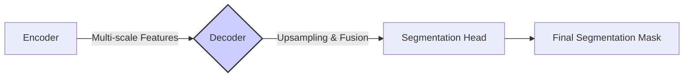
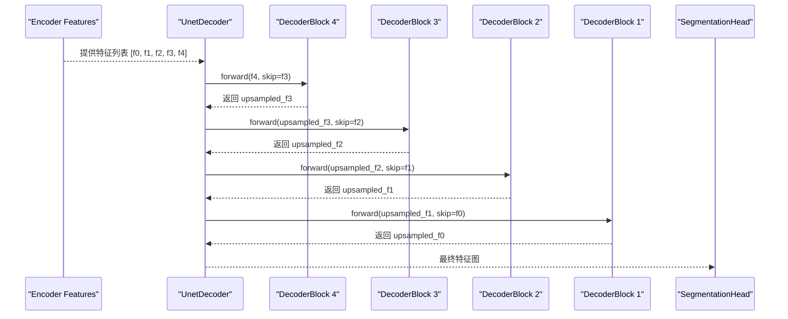

# 组件文档: Decoders (解码器)

## 1. 组件简介

**解码器（Decoder）** 是图像分割模型的另一个核心部分，其职责与编码器正好相反。它接收由编码器生成的多尺度、低分辨率、高语义的特征图，并逐步将它们 **上采样（Upsample）** 到原始输入图像的尺寸，最终生成像素级的分割掩码。

在 `segmentation_models.pytorch` (SMP) 库中，解码器是实现不同分割架构（如 UNet, FPN, DeepLabV3）的关键。它通过巧妙地融合编码器提供的多层次特征，来同时保证分割结果的语义准确性（来自深层特征）和边界精细度（来自浅层特征）。

**在系统中的定位：** 解码器是数据流的后半部分，它将编码器提取的抽象特征“翻译”成人类可理解的、密集的像素分类图。



## 2. 核心功能与 API

### 核心功能

* **上采样：** 通过转置卷积（Transpose Convolution）或双线性插值（Bilinear Interpolation）等方法，逐步放大特征图的尺寸。
* **特征融合：** 将来自编码器不同阶段的特征图（通常通过“跳跃连接”/“Skip Connections”）与当前上采样路径中的特征图进行融合（如拼接 Concat 或相加 Add）。这是恢复空间细节的关键。
* **通道调整：** 通过卷积层调整特征图的通道数，为最终的分类做准备。

### 对外暴露的 API

与编码器类似，解码器没有一个统一的 `get_decoder` 函数。相反，每个解码器架构都是一个独立的 `torch.nn.Module` 类，可以直接实例化。这些类通常共享相似的初始化参数。

**以 `UnetDecoder` 为例的 API (`segmentation_models_pytorch/decoders/unet/decoder.py`):**

```python
class UnetDecoder(nn.Module):
    def __init__(
        self,
        encoder_channels,
        decoder_channels,
        n_blocks=5,
        use_batchnorm=True,
        attention_type=None,
        center=False,
    ):
        # ...
```

* `encoder_channels` (tuple): 编码器输出的每个阶段特征图的通道数。这是解码器与编码器匹配的关键接口。
* `decoder_channels` (tuple): 解码器每个上采样阶段期望的输出通道数。
* `n_blocks` (int): 解码器包含的上采样块的数量，通常应与编码器的深度匹配。
* `use_batchnorm` (bool): 是否在解码器中使用批量归一化。
* `attention_type` (str | None): 是否在跳跃连接中使用注意力机制（如 'scse'），以增强相关特征。
* `center` (bool): 是否在编码器和解码器之间添加一个额外的“中心”块（bottleneck），通常用于处理编码器最深层的特征。

## 3. 内部结构

所有解码器都继承自 `torch.nn.Module`，并遵循一个相似的设计模式。

### a. 通用结构

大多数解码器（如 `UnetDecoder`, `FpnDecoder`）的内部都包含一系列的 **解码器块（Decoder Block）**。每个块负责一个阶段的上采样和特征融合。

**以 `UnetDecoder` 的 `DecoderBlock` 为例 (`segmentation_models_pytorch/decoders/unet/decoder.py`):**

1. **接收输入：** 接收来自上一级解码器块的特征图 `x` 和来自编码器对应阶段的跳跃连接特征图 `skip`。
2. **上采样：** 对 `x` 进行上采样，使其空间尺寸与 `skip` 相同。
3. **融合：** 将上采样后的 `x` 和 `skip` 进行拼接（Concatenate）。
4. **卷积：** 通过一两个卷积层（通常是 `Conv2dReLU` + `BatchNorm`）来处理融合后的特征，并调整通道数。
5. **输出：** 输出处理后的特征图，传递给下一个解码器块。

### b. 内部工作流程图 (UnetDecoder)



### c. 不同解码器的差异

* **UNet:** 经典的对称结构，通过跳跃连接将编码器的每一层特征与解码器对应层融合。
* **FPN (Feature Pyramid Network):** 旨在构建一个多尺度的特征金字塔。它不仅有自下而上的编码路径和自上而下的解码路径，还有一个横向连接来融合特征。最终可以从金字塔的多个层次进行预测。
* **Linknet:** 结构上类似于 UNet，但其连接和块的设计更轻量级。
* **PSPNet (Pyramid Scene Parsing Network):** 在编码器输出的顶层特征上使用一个“金字塔池化模块”（Pyramid Pooling Module），从不同尺度上聚合上下文信息，然后再进行上采样。
* **DeepLabV3/V3+:** 使用“空洞空间金字塔池化”（Atrous Spatial Pyramid Pooling, ASPP）模块来捕捉多尺度信息，并有更精细的解码路径设计。

## 4. 数据模型

* **输入：**
  * `features`: `List[torch.Tensor]`。编码器输出的特征图列表。
* **输出：**
  * `mask`: `torch.Tensor`。一个高分辨率的特征图，通常形状为 `(N, C_out, H/2, W/2)` 或 `(N, C_out, H/4, W/4)`，准备传递给 `SegmentationHead`。

## 5. 交互细节

* **与 `Encoder` 的交互：** 解码器是编码器的直接消费者。它依赖于编码器输出的特征列表的 **顺序** 和 **通道数**。`encoder_channels` 参数是两者之间的“契约”。
* **与 `SegmentationHead` 的交互：** 解码器的输出是 `SegmentationHead` 的输入。`SegmentationHead` 负责将解码器输出的高维特征图转换为最终的、具有类别通道的分割掩码。
* **与 `SegmentationModel` 的交互：** `SegmentationModel` 在 `forward` 方法中，将编码器的输出传递给解码器。

## 6. 设计考量

* **模块化和可重用性：** 将常见的操作（如 `DecoderBlock`）封装成独立的、可重用的模块。这使得代码更清晰，也方便了新解码器的开发。
* **配置驱动：** 解码器的行为（如通道数、是否使用批归一化、注意力机制等）都是通过初始化参数来控制的。这种设计提高了灵活性，用户可以微调解码器结构以适应不同的需求。
* **对不同架构的实现：** 库中包含了多种主流的解码器架构，为用户提供了丰富的选择。每种解码器都针对其原始论文的核心思想进行了实现（如 PSPNet 的金字塔池化，DeepLabV3+ 的 ASPP）。
* **注意力机制的集成：** 在 UNet 和其他解码器中可选地加入 `scSE` (Spatial and Channel Squeeze & Excitation) 注意力模块，这是一个很好的设计。它允许模型自适应地重新校准特征，增强有用的特征并抑制无关的特征，通常能带来性能提升。
