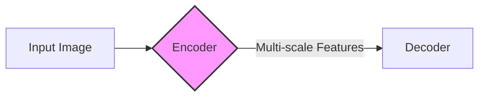
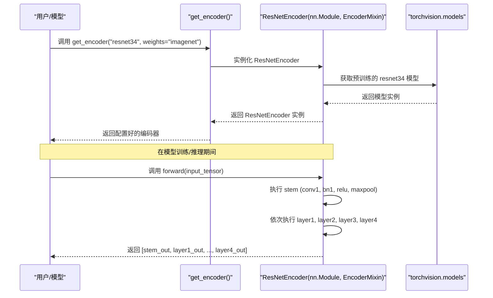

# 组件文档: Encoders (编码器)

## 1. 组件简介

**编码器（Encoder）** 是图像分割模型的核心组成部分，其主要职责是 **特征提取**。它接收输入图像，并通过一系列卷积和池化操作，生成具有丰富语义信息的多尺度特征图（Feature Maps）。这些特征图是后续解码器进行像素级预测的基础。

在 `segmentation_models.pytorch` (SMP) 库中，编码器通常是强大的、在大型数据集（如 ImageNet）上预训练过的分类网络，例如 ResNet、EfficientNet、VGG 等。这种利用 **迁移学习** 的方式，使得模型能够更快地收-e vergence，并在目标任务上取得更好的性能。

**在系统中的定位：** 编码器是整个分割模型的“骨干”（Backbone），是数据流的第一个处理单元，为系统的其余部分提供信息基础。



## 2. 核心功能与 API

### 核心功能

* **下采样与特征提取：** 将高分辨率、低语义的输入图像，转换为一系列低分辨率、高语义的特征图。
* **提供多尺度特征：** 输出多个中间层的特征图。不同尺度的特征图包含了不同层次的信息（浅层特征包含纹理、边缘等细节，深层特征包含目标、部件等抽象概念），这对于解码器精确重建分割掩码至关重要。
* **加载预训练权重：** 支持从 ImageNet 加载预训练权重，以加速训练和提升性能。

### 对外暴露的 API

编码器组件最核心的对外接口是 `segmentation_models_pytorch.encoders.get_encoder` 函数。

```python
def get_encoder(
    name: str,
    in_channels: int = 3,
    depth: int = 5,
    weights: Optional[str] = "imagenet",
    output_stride: int = 32,
    **kwargs,
) -> nn.Module:
```

* `name` (str): 编码器的名称，例如 `"resnet34"`, `"efficientnet-b0"`。
* `in_channels` (int): 输入图像的通道数（例如，RGB 图像为 3）。
* `depth` (int): 编码器的深度，决定了输出特征图的数量和下采样的次数。通常为 5。
* `weights` (str | None): 预训练权重的来源。通常是 `"imagenet"` 或 `None`（随机初始化）。
* `output_stride` (int): 控制模型输出特征图相对于输入图像的步幅。较小的 `output_stride`（如 8 或 16）可以产生更高分辨率的特征图，有利于分割小物体，但这通常需要对网络结构进行修改（例如，使用空洞卷积）。

## 3. 内部结构

编码器的内部结构主要由 `EncoderMixin` 基类和众多具体的编码器实现组成。

### a. `EncoderMixin` (位于 `segmentation_models_pytorch/encoders/_base.py`)

这是一个 `mixin` 类，为所有编码器实现提供了统一的接口和基础功能。

* **核心属性:**
  * `self._out_channels`: 一个元组，存储了每个输出阶段特征图的通道数。例如 `(3, 64, 256, 512, 1024, 2048)`。
  * `self._depth`: 编码器的深度。
  * `self._in_channels`: 输入通道数。
* **核心方法:**
  * `forward(self, x)`: 所有编码器都必须实现的前向传播方法。它接收输入张量 `x`，并返回一个包含多个尺度特征图的列表。
  * `load_state_dict(self, state_dict, **kwargs)`: 重载了 PyTorch 的方法，用于加载预训练权重。
  * `make_dilated(self, stage_list, dilation_list)`: 将指定阶段的卷积层转换为空洞卷积，用于控制 `output_stride`。

### b. 具体编码器实现 (例如 `segmentation_models_pytorch/encoders/resnet.py`)

每个编码器文件（如 `resnet.py`, `efficientnet.py`）都定义了一个或多个继承自 `torch.nn.Module` 和 `EncoderMixin` 的类。

**以 ResNetEncoder 为例的内部逻辑：**

1. **初始化 (`__init__`)**:
    * 根据指定的 `name` 和 `weights`，从 `torchvision.models` 或 `timm` 库获取一个预训练的 ResNet 实例。
    * 移除原始 ResNet 的全连接层（分类头）和平均池化层。
    * 设置 `_out_channels` 和其他 `EncoderMixin` 要求的属性。
2. **前向传播 (`forward`)**:
    * 输入张量 `x` 依次通过 ResNet 的初始卷积层 (`conv1`, `bn1`, `relu`, `maxpool`)。
    * 将初始特征和后续每个 stage（`layer1`, `layer2`, `layer3`, `layer4`）的输出特征图收集到一个列表中。
    * 根据 `_depth` 返回相应数量的特征图。

### 内部工作流程图



## 4. 数据模型

编码器处理的数据是标准的 PyTorch 张量（Tensors）。

* **输入：**
  * `x`: `(N, C_in, H, W)`，其中 N 是批量大小，C_in 是输入通道数，H 和 W 是图像的高和宽。
* **输出：**
  * `features`: `List[torch.Tensor]`。一个包含 `depth + 1` 个张量的列表。
  * 列表中的第一个张量是输入图像本身（或经过 stem 后的特征）。
  * 后续每个张量的形状为 `(N, C_i, H/2^i, W/2^i)`，其中 `i` 是下采样阶段的索引，`C_i` 是该阶段的输出通道数。

## 5. 交互细节

编码器主要与 **解码器（Decoder）** 和 **模型基类（SegmentationModel）** 进行交互。

* **与 `SegmentationModel` 的交互：**
  * `SegmentationModel` 在初始化时调用 `get_encoder` 来创建编码器实例。
  * 在 `forward` 过程中，`SegmentationModel` 将输入数据传递给编码器的 `forward` 方法。
* **与 `Decoder` 的交互：**
  * 编码器 `forward` 方法的输出（特征图列表）被直接作为输入传递给解码器的 `forward` 方法。解码器依赖于这个列表中的多尺度信息来工作。

## 6. 设计考量

* **与 `timm` 库的集成：** 大量编码器（特别是较新的，如 EfficientNetV2, ViT 等）直接通过 `timm` 库加载。这是一个明智的决策，因为它避免了重复实现这些复杂的模型，并能直接利用 `timm` 社区维护的高质量预训练权重。
* **统一的 `EncoderMixin` 接口：** 这是实现“可插拔”架构的关键。通过强制所有编码器都遵循 `EncoderMixin` 定义的规范（如 `_out_channels` 属性和 `forward` 的返回格式），使得上层模块（解码器）可以无差别地与任何编码器配合使用。
* **灵活性与易用性的平衡：** `get_encoder` 函数提供了一个非常简单的入口点，但同时通过 `**kwargs` 提供了对底层编码器进行更精细控制的可能性，实现了易用性和灵活性的良好平衡。
* **对 `output_stride` 的支持：** 通过 `make_dilated` 方法支持空洞卷积，这对于需要更高分辨率特征图的场景（如 DeepLabV3+）至关重要，增加了模型的适用范围。
