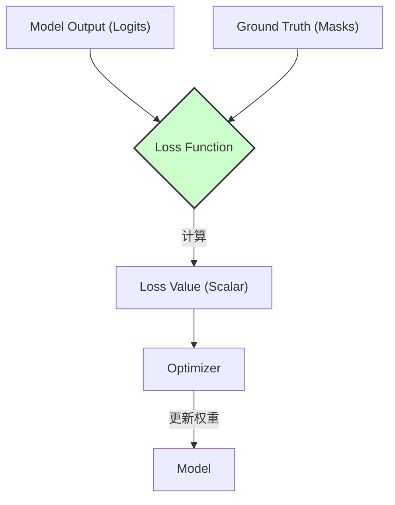
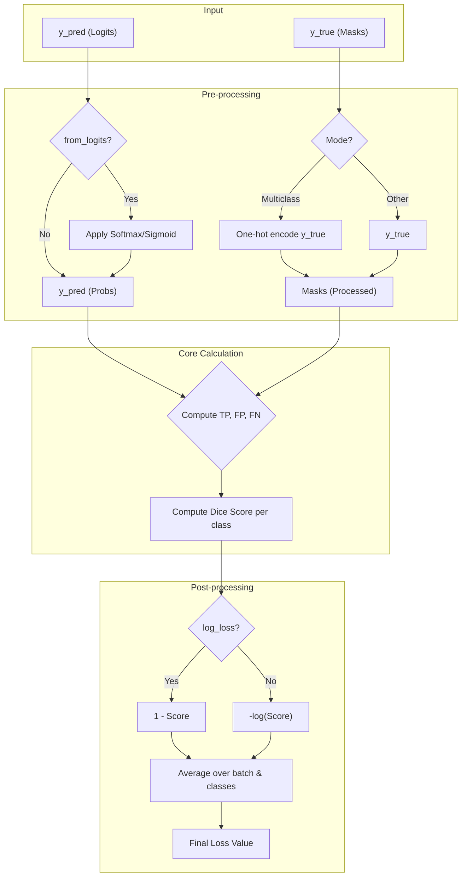

# 组件文档: Losses (损失函数)

## 1. 组件简介

**损失函数（Loss Function）** 在深度学习模型的训练过程中扮演着“裁判”的角色。它的核心职责是 **量化模型预测结果与真实标签（Ground Truth）之间的差异**。这个差异值（即“损失”）是一个标量，它指导着优化器（Optimizer）如何调整模型参数，以期在下一次预测中做得更好。

在图像分割任务中，损失函数直接影响模型的学习方向和最终性能。例如，一些损失函数对类别不平衡问题更鲁棒，而另一些则更关注分割边界的精确性。

`segmentation_models.pytorch` (SMP) 提供了一系列专门为图像分割设计的、可组合的损失函数。

**在系统中的定位：** 损失函数是连接模型输出和优化器的桥梁，是训练流程的核心计算单元。



## 2. 核心功能与 API

### 核心功能

* **计算差异：** 根据不同的数学定义（如 Dice, Jaccard, Focal Loss 等），计算预测值和真实值之间的惩罚项。
* **处理不同数据格式：** 能够处理二进制、多类别和多标签等不同模式的分割任务。
* **可组合性：** 允许将多个损失函数通过加权求和的方式组合在一起，形成一个混合损失，以利用不同损失的优点。
* **平滑（Smoothing）：** 提供平滑参数以防止过拟合和处理数值不稳定性。

### 对外暴露的 API

SMP 中的所有损失函数都继承自一个基类 `smp.losses.Loss`，该基类又继承自 `torch.nn.Module`。它们共享一个统一的接口。

**以 `DiceLoss` 为例的 API (`segmentation_models_pytorch/losses/dice.py`):**

```python
class DiceLoss(Loss):
    def __init__(
        self,
        mode: str = "multilabel",
        classes: Optional[List[int]] = None,
        log_loss: bool = False,
        from_logits: bool = True,
        smooth: float = 0.0,
        ignore_index: Optional[int] = None,
        eps: float = 1e-7,
    ):
        # ...
```

* `mode` (str): 指定分割任务的模式。这是最关键的参数之一。
  * `'binary'`: 二分类任务（一个前景，一个背景）。
  * `'multiclass'`: 多分类任务（每个像素只属于一个类别）。
  * `'multilabel'`: 多标签任务（每个像素可属于多个类别）。
* `classes` (List[int] | None): 在 `multiclass` 或 `multilabel` 模式下，指定要计算损失的类别索引。如果为 `None`，则计算所有类别。
* `log_loss` (bool): 如果为 `True`，则计算 `-log(DiceScore)`，这有助于稳定训练。
* `from_logits` (bool): 指示输入是原始的 `logits`（未经激活函数）还是已经经过 `sigmoid` 或 `softmax` 的概率值。库内部会根据此参数自动应用适当的激活函数。
* `smooth` (float): 一个小的平滑因子，加在分子和分母上，以避免除以零的错误，并平滑损失曲面。
* `ignore_index` (int | None): 指定在计算损失时要忽略的真实标签中的某个类别索引（例如，未标注的区域）。

### 组合损失

SMP 允许使用 `+` 和 `*` 操作符轻松组合损失：

```python
# 组合 Jaccard Loss 和 Dice Loss
loss = smp.losses.JaccardLoss() + smp.losses.DiceLoss()

# 加权组合
loss = 0.5 * smp.losses.JaccardLoss() + 1.5 * smp.losses.DiceLoss()
```

## 3. 内部结构

### a. `Loss` 基类 (`segmentation_models_pytorch/losses/__init__.py`)

这个基类通过重载 `__add__` 和 `__mul__` 等魔法方法，实现了优雅的损失组合功能。

* `__add__(self, other)`: 返回一个 `SumOfLosses` 实例。
* `__mul__(self, weight)`: 返回一个 `WeightedLoss` 实例。

### b. 具体损失实现 (例如 `DiceLoss`)

1. **初始化 (`__init__`)**:
    * 调用父类 `Loss` 的构造函数。
    * 存储所有配置参数（`mode`, `from_logits` 等）。
2. **前向传播 (`forward`)**:
    * 接收 `y_pred` (模型预测) 和 `y_true` (真实标签) 两个张量。
    * **预处理：**
        * 根据 `from_logits` 参数，对 `y_pred` 应用 `sigmoid` 或 `softmax` 激活函数，将其转换为概率。
        * 根据 `mode`，对 `y_true` 和 `y_pred` 进行维度检查和转换，确保它们具有兼容的格式（例如，对多分类的 `y_true` 进行 one-hot 编码）。
        * 处理 `ignore_index`，将对应像素的损失贡献置为零。
    * **核心计算：**
        * 计算真阳性（TP）、假阳性（FP）和假阴性（FN）。这是通过对概率图和真实掩码进行逐元素乘法和求和来完成的。
        * 根据 Dice 系数的公式 `(2 * TP) / (2 * TP + FP + FN)` 计算分数。
    * **后处理：**
        * 根据 `log_loss` 参数决定是返回 `1 - score` 还是 `-log(score)`。
        * 对批次和类别维度进行平均，得到最终的标量损失值。

### 内部计算流程图 (`DiceLoss`)



## 4. 数据模型

* **输入:**
  * `y_pred`: `(N, C, H, W)`，模型输出的原始 logits。`C` 是类别数。
  * `y_true`: `(N, H, W)` (对于 multiclass) 或 `(N, C, H, W)` (对于 multilabel)。
* **输出:**
  * `loss`: `torch.Tensor`，一个零维的张量（标量），代表该批次的平均损失。

## 5. 交互细节

* **与 `SegmentationModel` 的交互：** 损失函数在训练和评估循环中被调用。模型本身不直接与损失函数交互，而是由训练脚本来协调。
* **与 `torch.autograd` 的交互：** 损失函数的所有计算都是在 PyTorch 的计算图中进行的。当调用 `loss.backward()` 时，`autograd` 引擎会自动计算损失相对于模型参数的梯度。

## 6. 设计考量

* **接口统一性：** 所有损失函数共享相同的 `__init__` 参数（如 `mode`, `from_logits`），这使得在不同损失之间切换变得非常容易，只需更改类名即可。
* **鲁棒性：** `smooth` 和 `eps` 参数的引入，以及对 `from_logits` 的自动处理，都体现了对数值稳定性和用户体验的考量。用户无需手动应用激活函数，减少了出错的可能性。
* **灵活性和组合性：** 通过操作符重载实现损失的组合，是该库一个非常优雅和强大的设计。它允许研究人员和工程师轻松地实验复杂的、自定义的损失函数，而无需编写新的类。
* **全面的损失函数选择：** 提供了多种常用及一些不那么常见的分割损失（如 TverskyLoss, LovaszLoss），覆盖了从基础到高级的各种需求，满足了不同场景下的应用（如类别不平衡、小目标检测等）。
