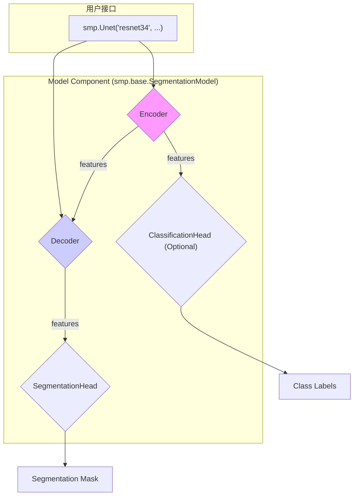
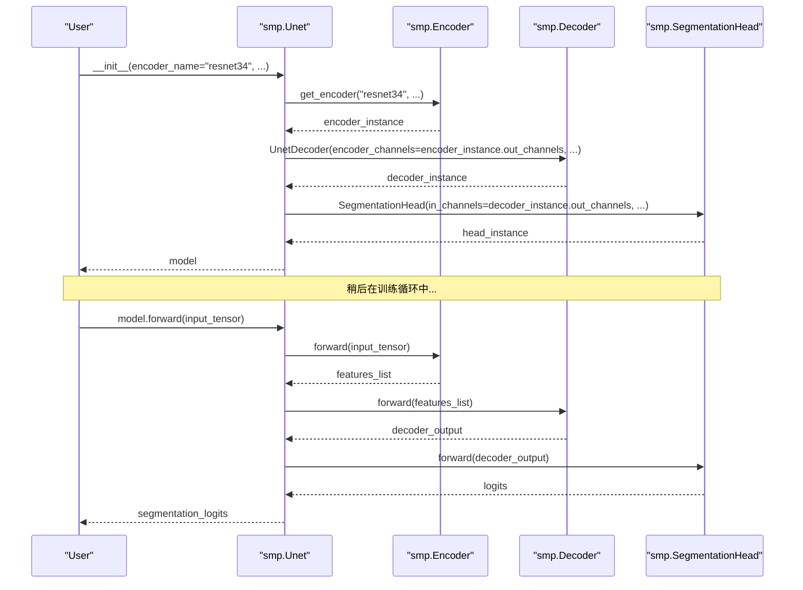

# 组件文档: Models (模型)

## 1. 组件简介

**模型（Model）** 组件是 `segmentation_models.pytorch` (SMP) 库的顶层封装，是用户直接与之交互的最终产品。它的核心职责是 **整合编码器（Encoder）、解码器（Decoder）以及可选的分割头（SegmentationHead）和分类头（ClassificationHead），形成一个端到端的、可训练的神经网络**。

这个组件将底层复杂的模块连接逻辑抽象出来，为用户提供了一个极其简洁的接口来创建各种先进的图像分割模型。用户只需一行代码，就能实例化一个完整的、由特定编码器和解码器构成的模型，如 `smp.Unet(...)`。

**在系统中的定位：** 模型是整个系统的“装配工厂”和“总指挥”，它定义了数据在编码器、解码器和头部之间流动的前向传播路径。



## 2. 核心功能与 API

### 核心功能

* **模块组装：** 在初始化时，根据用户指定的参数（如编码器名称、解码器架构等）自动创建和连接所有必要的子模块。
* **端到端前向传播：** 定义 `forward` 方法，处理从输入图像到最终输出（分割掩码和/或分类标签）的完整流程。
* **多头输出：** 支持同时输出分割掩码和分类标签，适用于一些需要同时进行像素级分割和图像级分类的复合任务。
* **设备管理：** 提供了 `.to(device)` 方法，方便地将整个模型及其所有子模块移动到指定的计算设备（如 GPU）。

### 对外暴露的 API

API 主要由 `smp.base.SegmentationModel` 基类和一系列继承自它的具体模型类（如 `smp.Unet`, `smp.FPN`, `smp.DeepLabV3`）提供。

**`smp.base.SegmentationModel` 的初始化 API:**

```python
class SegmentationModel(torch.nn.Module):
    def initialize(self):
        init.initialize_decoder(self.decoder)
        init.initialize_head(self.segmentation_head)
        if self.classification_head is not None:
            init.initialize_head(self.classification_head)
```

* 这个基类本身不直接实例化，但它定义了所有模型共享的行为。`initialize` 方法负责对解码器和头部的权重进行初始化。

**以 `smp.Unet` 为例的用户 API:**

```python
class Unet(SegmentationModel):
    def __init__(
        self,
        encoder_name: str = "resnet34",
        encoder_depth: int = 5,
        encoder_weights: Optional[str] = "imagenet",
        decoder_use_batchnorm: bool = True,
        decoder_channels: List[int] = (256, 128, 64, 32, 16),
        decoder_attention_type: Optional[str] = None,
        in_channels: int = 3,
        classes: int = 1,
        activation: Optional[Union[str, callable]] = None,
        aux_params: Optional[dict] = None,
    ):
        # ...
```

* `encoder_name`, `encoder_depth`, `encoder_weights`: 这些参数直接传递给 `smp.encoders.get_encoder` 来创建编码器。
* `decoder_use_batchnorm`, `decoder_channels`, `decoder_attention_type`: 这些参数用于配置 `UnetDecoder`。
* `in_channels`: 输入图像的通道数。
* `classes`: 分割任务的类别数。
* `activation`: 应用于分割头输出的最终激活函数（如 `'sigmoid'`, `'softmax'`）。如果为 `None`，则输出原始 `logits`，这在与 `smp.losses`（它们通常期望 `logits`）一起使用时非常方便。
* `aux_params`: 一个字典，用于配置可选的分类头。如果提供，模型将额外包含一个分类分支。

## 3. 内部结构

### a. `SegmentationModel` 基类 (`smp.base.model.py`)

这是所有模型类的父类，定义了核心的 `forward` 逻辑和一些通用方法。

* **`__init__`**: 构造函数是空的，实际的初始化在子类中完成。
* **`forward(self, x)`**:
    1. 调用 `self.encoder(x)` 获取多尺度特征列表。
    2. 调用 `self.decoder(*features)` 获取解码后的高维特征。
    3. 调用 `self.segmentation_head(decoder_output)` 生成分割 `logits`。
    4. 如果存在 `self.classification_head`，则从编码器特征中提取用于分类的特征（通常是最高级的特征），并传递给分类头生成分类 `logits`。
    5. 返回分割 `logits`，或者如果分类头存在，则返回一个包含分割和分类 `logits` 的元组。
* **`predict(self, x)`**: 一个方便的方法，它调用 `forward` 并将最终的激活函数应用于输出，直接生成可解释的预测结果（如概率图或类别索引图）。

### b. 具体模型类 (例如 `smp.Unet`)

这些类是 `SegmentationModel` 的具体实现，它们的核心任务是在 `__init__` 方法中完成所有组件的“装配”。

**`Unet.__init__` 的内部逻辑：**

1. **创建编码器：** 调用 `smp.encoders.get_encoder(...)`，传入所有 `encoder_*` 参数。
2. **创建解码器：** 实例化 `UnetDecoder`，将编码器的输出通道 `encoder.out_channels` 和用户指定的 `decoder_*` 参数传递给它。
3. **创建分割头：** 实例化 `SegmentationHead`，配置其输入通道（匹配解码器的输出通道）、输出通道（`classes`）、激活函数和上采样因子。
4. **创建分类头（可选）：** 如果 `aux_params` 被提供，则实例化 `ClassificationHead`，配置其输入通道（通常匹配编码器最深层特征的通道数）和输出类别数。
5. **命名模块：** 将创建的所有子模块赋值给 `self`（如 `self.encoder`, `self.decoder`），以便基类的 `forward` 方法可以访问它们。
6. **初始化权重：** 调用 `self.initialize()` 来对新创建的解码器和头部的权重进行初始化。

### 内部工作流程图 (`Unet` 实例化与 `forward` 调用)



## 4. 数据模型

* **输入:**
  * `x`: `(N, C_in, H, W)`，输入的图像张量。
* **输出:**
  * 如果无分类头：`masks`: `(N, C_out, H_out, W_out)`，分割 `logits`。
  * 如果有分类头：`(masks, labels)`，一个元组，包含分割 `logits` 和分类 `logits` `(N, Num_classes)`。

## 5. 交互细节

* **与用户/训练脚本的交互：** 模型是用户交互的主要入口。用户创建模型实例，将其传递给优化器，并在训练循环中调用其 `forward` 方法。
* **与所有子模块的交互：** 模型是所有内部组件（编码器、解码器、头）的“所有者”和“协调者”。它负责在初始化时创建它们，并在前向传播时按正确的顺序调用它们。

## 6. 设计考量

* **高度抽象和易用性：** 这是 SMP 库最成功的设计决策之一。将复杂的模型构建过程封装在单一的、易于理解的类中，极大地降低了使用门槛。用户不需要成为模型架构专家，就能使用 SOTA 模型。
* **一致的 API：** 所有模型类（`Unet`, `FPN`, `PSPNet` 等）都共享一套非常相似的初始化参数。这使得用户可以轻松地在不同的模型架构之间进行实验，通常只需改变类名和少数 `decoder_*` 参数。
* **通过 `aux_params` 实现辅助任务：** 将可选的分类头通过一个 `aux_params` 字典来配置，这是一个非常灵活和干净的设计。它避免了用大量 `if/else` 和额外的参数来污染主 `__init__` 方法的签名，使得主流程（分割）保持清晰。
* **解耦配置与实现：** 模型类的 `__init__` 方法主要负责“配置”和“组装”，而实际的计算逻辑则委托给 `SegmentationModel` 基类的 `forward` 方法和各个子模块。这种分离使得代码更易于维护和扩展。
* **明确的 `predict` 方法：** 单独提供一个 `predict` 方法来处理激活函数的应用，这是一个很好的实践。它使得 `forward` 方法的输出保持纯净（`logits`），这对于计算损失是必需的，同时又为推理和可视化提供了一个方便的快捷方式。
