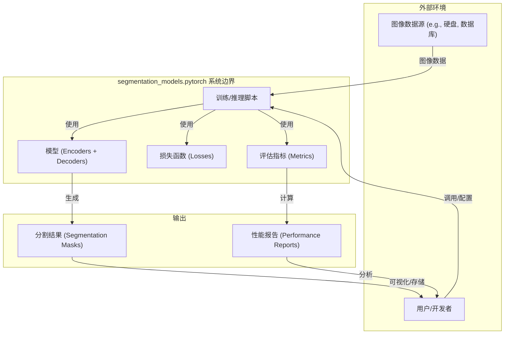

# 系统总览 (System Overview)

本文档旨在提供 `segmentation_models.pytorch` 项目的高层架构概览，帮助开发者快速理解系统的核心目标、组件构成、交互方式以及关键架构决策。

## 1. 核心目标与业务领域

`segmentation_models.pytorch` 是一个基于 PyTorch 的深度学习库，专注于 **图像分割 (Image Segmentation)** 任务。其核心目标是：

* **提供即用型模型：** 提供一系列预训练的、SOTA（State-of-the-Art）的图像分割模型，让开发者可以轻松地将其应用于各种计算机视觉项目。
* **高度可定制化：** 允许用户灵活地组合不同的编码器（Backbones）和解码器（Decoders），以构建满足特定需求的定制化模型。
* **简化开发流程：** 封装了训练和评估过程中的常用功能，如损失函数、评估指标和数据预处理，从而加速开发周期。

**业务领域：** 医疗影像分析、自动驾驶、卫星图像处理、工业质检等所有需要像素级图像理解的场景。

**主要用户角色：**

* **AI/ML 工程师：** 使用该库来快速构建、训练和部署图像分割模型。
* **研究人员：** 利用该库作为基线模型，进行新的分割算法研究。
* **数据科学家：** 将其应用于特定领域的数据分析和模式识别。

## 2. 系统边界

系统接收 **图像数据**（如 `(Batch, Channels, Height, Width)` 的张量）作为输入，并输出 **分割掩码**（`(Batch, NumClasses, Height, Width)` 的张量），其中每个像素值代表其所属的类别。

## 3. 组件交互与数据流

系统的核心是 **模型（Model）**，它由一个 **编码器（Encoder）** 和一个 **解码器（Decoder）** 组成。数据流如下：

1. **输入图像** 首先被送入 **编码器**。编码器（通常是一个预训练的卷积神经网络，如 ResNet）负责提取多层次的特征图（Feature Maps）。这些特征图尺寸逐渐变小，但通道数（深度）增加，包含了从低级到高级的语义信息。
2. 编码器输出的 **多尺度特征图** 被传递给 **解码器**。
3. **解码器**（如 UNet, FPN）接收这些特征图，通过一系列的上采样（Upsampling）和卷积操作，逐步将特征图恢复到原始图像尺寸，并最终生成像素级的分割掩码。
4. 在训练过程中，模型的输出（分割掩码）会与 **真实标签（Ground Truth）** 一起送入 **损失函数（Loss Function）**，计算出损失值。
5. 优化器根据损失值更新模型的权重。
6. 同时，**评估指标（Metrics）** 会被用来监控模型在验证集上的性能。

### 系统级数据流图 (Mermaid)

## 4. 架构决策与考量

### a. 模块化与可组合性

* **决策：** 将编码器和解码器完全解耦。
* **考量：** 这是本库最核心的设计理念。通过定义清晰的接口，用户可以像搭积木一样自由组合不同的编码器和解码器。这极大地提高了灵活性和可扩展性，方便用户尝试不同的模型架构，也使得添加新的编码器/解码器变得容易。

### b. 基于 PyTorch 生态

* **决策：** 完全基于 PyTorch 构建，并与 `timm` (PyTorch Image Models) 等流行库深度集成。
* **考量：** PyTorch 提供了强大的灵活性和动态图机制，非常适合研究和开发。集成 `timm` 使得项目能够快速利用大量高质量的预训练骨干网络作为编码器，而无需重复造轮子。

### c. 预训练权重的使用

* **决策：** 为所有编码器提供在 ImageNet 上的预训练权重。
* **考量：** 图像分割任务通常受益于迁移学习。使用预训练权重可以显著加快模型收敛速度，提高在小数据集上的性能，并降低训练成本。

### d. 易用性与封装

* **决策：** 提供一个统一的 `SegmentationModel` 基类，封装了编码器、解码器和分割头（Head）的组装逻辑。
* **考量：** 开发者无需关心如何手动连接各个模块的细节。只需通过简单的函数调用（如 `smp.Unet(...)`），即可实例化一个完整的、可用的分割模型，降低了使用门槛。

### e. 可靠性与测试

* **决策：** 项目包含一个全面的测试套件 (`/tests`)。
* **考量：** 确保代码的可靠性和稳定性。测试覆盖了核心组件、损失函数、模型输出尺寸等关键部分，保证了代码变更不会轻易破坏现有功能。

### f. 扩展性

* **决策：** 采用基于类的模块化设计，并为编码器、解码器等定义了基类和清晰的接口。
* **考量：** 用户可以方便地通过继承基类的方式，实现自己的自定义编码器、解码器或损失函数，并无缝地集成到现有框架中。
